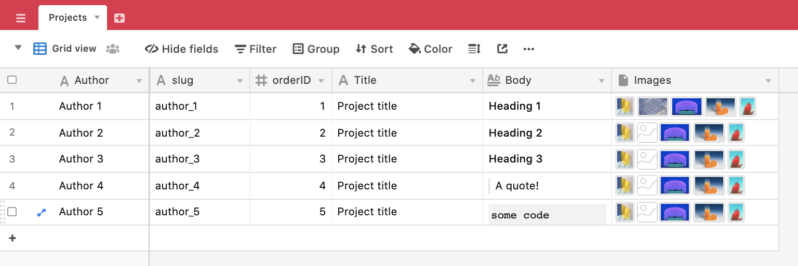

## Airtable - Gatsby boilerplate


### Install 
`yarn install` to install and `yarn develop` to run locally. Once you do that, you can use `http://localhost:8000/___graphql` to access the GraphQL IDE and run queries against the data pulled from the Airtable. 

It uses `gatsby-source-airtable` to work with the Airtable API [link](https://github.com/jbolda/gatsby-source-airtable).

### Airtable
This is how the Airtable used above looks like: . In order to be able to get data from an Airtable instance, you need to have an Airtable API key, the Airtable ID of the base, and the name of the Table (in this case `Projects`). Airtable has excellent <a href="https://airtable.com/api">guides</a> on how to do that.

Once you have the above, you need `gatsby-config.js` to be able to access them, but at the same time you do NOT want to commit these credentials to Github. As you can see below they are stored in an `env` process (which is local to your machine, and set up on wherever you are hosting your website as `environment variables`).

```
{
  resolve: `gatsby-source-airtable`,
  options: {
    apiKey: process.env.AIRTABLE_API_KEY,
    concurrency: 5, // default, see using markdown and attachments for more information
    tables: [
      {
        baseId: process.env.AIRTABLE_BASE,
        tableName: process.env.AIRTABLE_TABLE,
        mapping: { Body: 'text/markdown' },
        separateNodeType: false, // boolean, default is false, see the documentation on naming conflicts for more information
        separateMapType: false, // boolean, default is false, see the documentation on using markdown and attachments for more information
      }
    ]
  }
},
```

You need to create a `.env` file in root directory. Once you do that, enter your Airtable credentials as below: 

```
AIRTABLE_API_KEY=your_airtable_key
AIRTABLE_BASE=your_airtable_base_name
AIRTABLE_TABLE=your_table_name
```

Since the `.gitignore` file is set up to ignore `.env`, you don't need to worry about your credentials being shared publicly. Again, once you deploy, you will need to define the above variables again (Netlify and Vercel offer a super easy way to do that now). 

### How to edit
The code for the landing page is in `src/index.js`.

The code for the project page is in `src/templates/project.js`. 

Avoid editing `gatsby-node.js` and `gatsby-config.js` - they are the files that connect Airtable to Gatsby and operate the GraphQL queries.

### Styles
`styles/layout.css` contains the default Gatsby "reset" styles, and is overridden (if desirable) by `styles/addedStyles.css`, if necessary. <a href="https://www.gatsbyjs.org/docs/styling/">Here</a> is what Gatsby official docs say about styling.

This is a barebones boilerplate and can be developed in any way, but if you want to keep some consistency with the existing code, here is an example of an inline styled `<div></div>` element.

```
<div 
  key={index}
  style={{
    backgroundImage: 'url(' + image.url + ')',
    backgroundSize: '100%',
    backgroundPosition: 'top',
    width:'30vw', 
    height:'50vh', 
    margin: '2vh 0'
    }}>
</div>
```